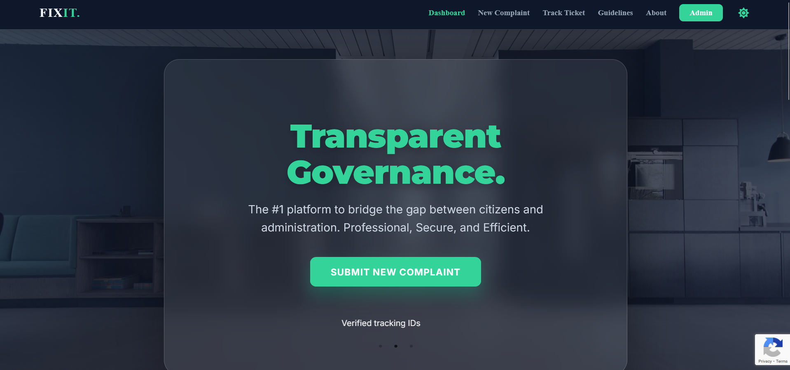
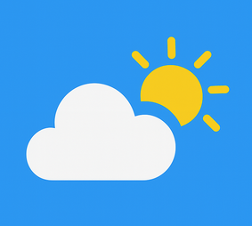

  

<h1 align="center">Hi there, I'm Mufeez Ahmed 👋</h1>

  <strong>Engineering Student | Full Stack Developer | VLSI Enthusiast</strong>

<h2 align="left">Core Stack & Engineering Suite</h2>

  

<h1 align="center">Favourite Projects </h1>

<table align="center" width="100%">
  <tr>
    <td align="center" width="50%" valign="top">
       
      
       
      <a href="https://github.com/Mufeez-Ahmed/FIXIT"><h2>🏛️ FIXIT</h2></a>
      
<b>Citizen Grievance Portal</b> React • Spring Boot • MySQL

      
A robust platform built to streamline citizen engagement and redressal.

    </td>
    <td align="center" width="50%" valign="top">
       
      
       
      <a href="https://github.com/Mufeez-Ahmed/SkyCast"><h2>🌤️ SkyCast</h2></a>
      
<b>Weather Experience</b> JavaScript • Tailwind • Vite

      
Real-time forecasts with a beautifully animated and responsive interface.

    </td>
  </tr>
</table>

---
